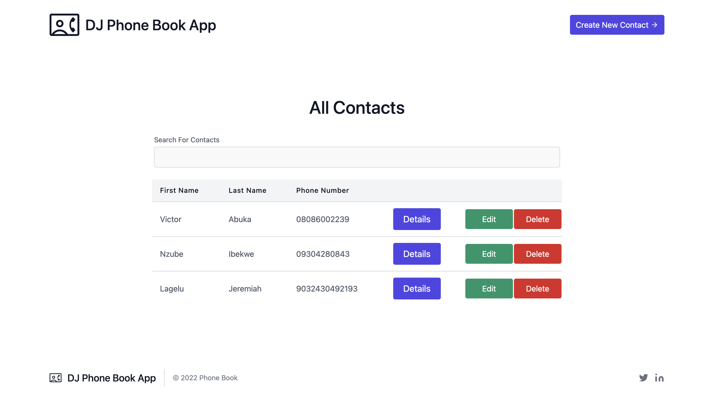

# Phone Book App

## Description

This repository contains files for a simple phone book application with CRUD (Create, Read, Update and Delete) Operations. the application provides a form where you can enter in your first name, last name and phone number.

## Setup

1. Clone this repository, like so:

```
git clone https://github.com/Abuka-Victor/Phone-Book.git
```
2. Open up the cloned directory in your terminal or command prompt
3. If you are a Mac/Ubuntu/Linux User:
    - Run script by entering the following command in your terminal:
 
     ```sh
     ./setup.sh
     ```
     > Dependency: Python3.6 and above
     
  
4. If you are a Windows user:
    - Make Sure Python 3.6 upwards is installed
    - Run the following commands in order
    ```py
    py -m venv venv
    venv\Scripts\activate.bat
    pip install django
    py manage.py migrate
    py manage.py runserver
    ```
    
You should get the following results


## Views




## Built With

- Django
- Tailwind CSS
- Semantic HTML

## Author

1. [ABUKA VICTOR](https://github.com/Abuka-Victor)

